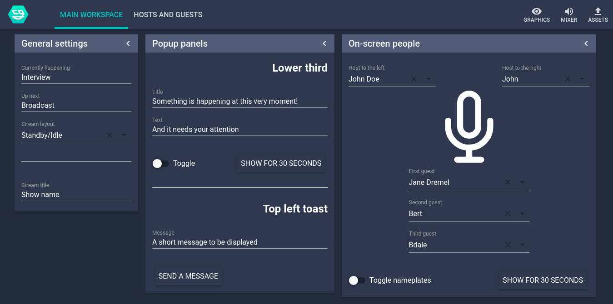
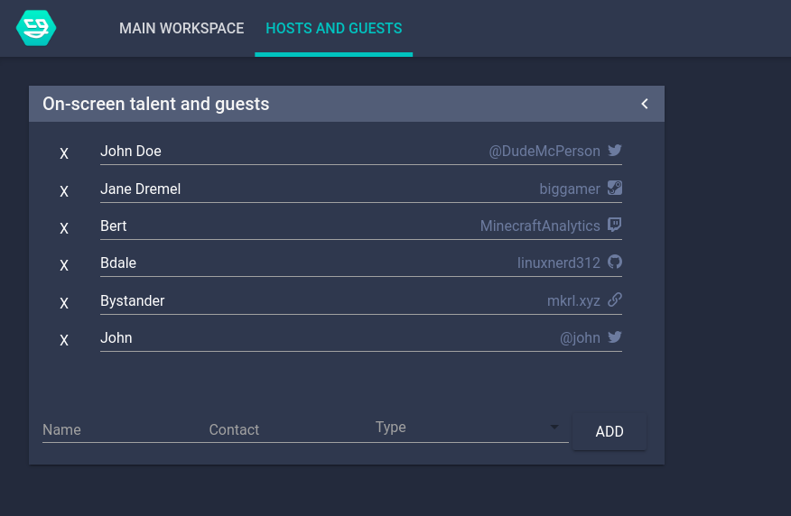
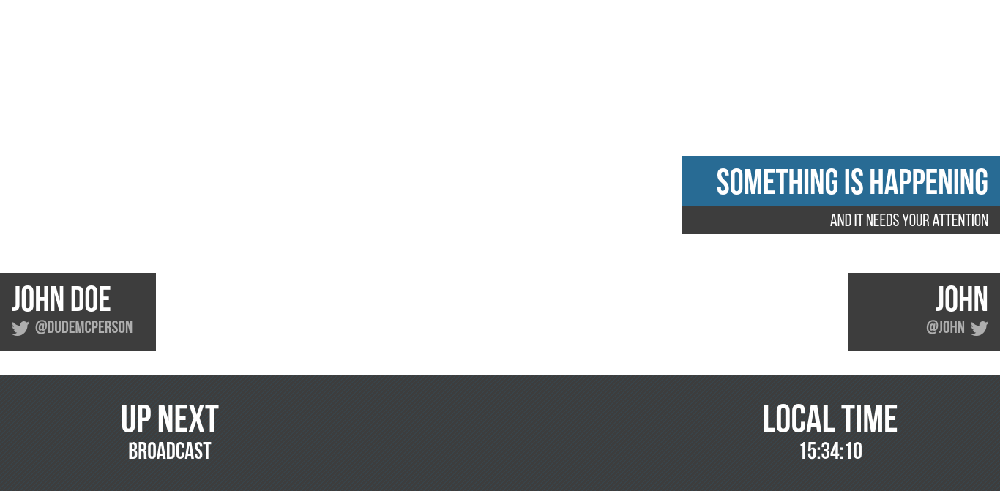

# nodecg-react-layouts

This [NodeCG](http://github.com/nodecg/nodecg) bundle, powered by React, and based on [Flux-like pattern system](https://github.com/mkrl/nodecg-react) for an easy state-to-[replicant](https://nodecg.com/NodeCG.html#Replicant) management.

It works with NodeCG versions which satisfy this [semver](https://docs.npmjs.com/getting-started/semantic-versioning) range: `^1.1.1`

## What's inside?

The bundle comes in with "CG essentials": nameplates, lower third, layout system and on-screen talent management system.  There's more stuff inside!







The main idea around the bundle is to have a quick and easy "set up and go" system you can modify fairly quickly, even in case of emergency. 

## Getting started

Copy/clone the repo into your `bundles` folder that is located in the root folder of your NodeCG instance.
```bash
cd bundles
git clone git@github.com:mkrl/nodecg-react-layouts.git
cd nodecg-react
```
Install dependencies
```bash
yarn
```

Start up your NodeCG instance. 

In order to generate asset bundle from sources, run `yarn start` at least once, as the repository does not initially come with pre-compiled assets.

## Developing

[Parcel](https://parceljs.org/) is a zero-configuration asset bundler. We use [Babel](https://babeljs.io/) to compile modern JavaScript with React into a single asset file that lives in our `/graphics` folder. 
In order to get started, run 
```bash
yarn start
```
This will spin up Parcel watch mode. Open your app through a NodeCG "graphics" tab. You can now make desired changes to your source files under `/src` and they will automatically be hot-reloaded in your browser.

The visual part of the bundle is built with [styled-components](https://www.styled-components.com/).

## Working with pre-built replicants and component state

Please check out the original [nodecg-react](https://github.com/mkrl/nodecg-react) readme for detailed info on how to work with replicant-to-state management system.

## Building

Even though running in a watch mode does produce working pieces of code, you are going to need a production build after you are done with your development process. Generating optimized and minified graphics is as simple as:

```bash
yarn build
```

## Contributing

Feel free to contribute, following this conventional and simple process:

 1. [Fork](https://github.com/mkrl/nodecg-react-layouts/fork)
 2. Create your feature branch (`git checkout -b new-cool-stuff`) 
 3. Commit (`git commit -am 'Add stuff'`) 
 4. Push to the branch (`git push origin new-cool-stuff`)
 5. Create a new Pull Request
